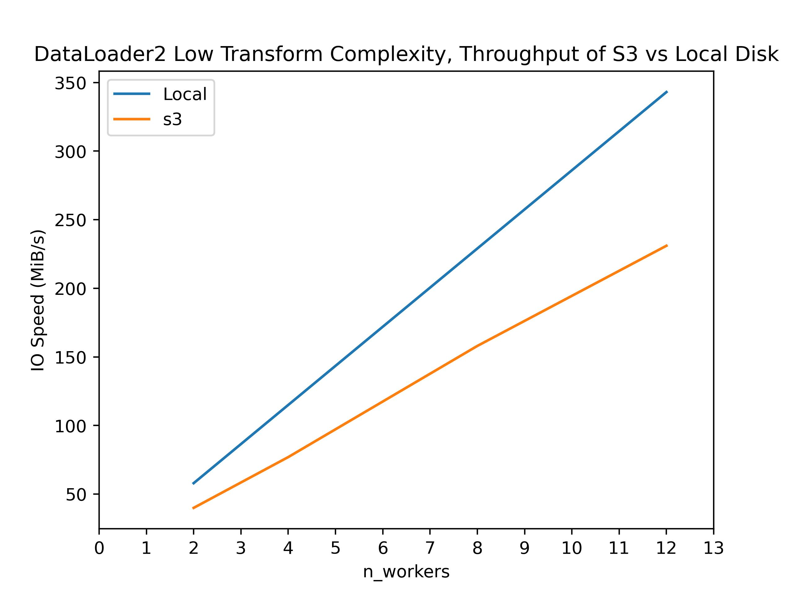
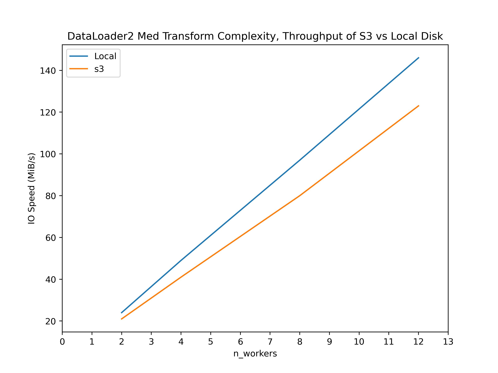
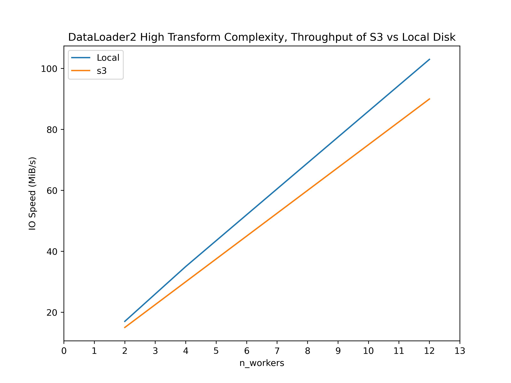

## AWS S3 Benchmark - Data Loading from S3 and Attached Volume

As we introduce
[various methods to load data from cloud service providers](https://pytorch.org/data/0.5/tutorial.html#working-with-cloud-storage-providers),
we are interested to know how the performance of loading from cloud compares to loading data from a local disk. We
created a [small script](aws_s3.py) to benchmark their throughputs (MiB/s) on an AWS EC2 instance.

### AWS EC2 Setup

- Instance Type: [c5.24xlarge](https://aws.amazon.com/ec2/instance-types/c5/)
- File system: gp2, AWS S3
- Dataset (50GB)
  - Each tar archive is ~100MB with ~1050 images
  - Each image (256 px × 256 px) is about 100kb in size
- Epochs:
  - 1 warm up epoch to isolate disk caching
  - 3-5 actual epochs
- Data transformation complexity
  - Low (~3ms/image), Medium (~7ms), High (~10ms)
- Number of workers: 2-12
  - We limit it to a reasonable number of workers as that is approximately what is likely used per GPU

Our observation is that the performance gap between loading from S3 and local disk tends to be relatively small when
your pre-processing/transformation operations are compute intensive. The exact result can vary depending on your
instance’s disk IO throughput and network bandwidth.

